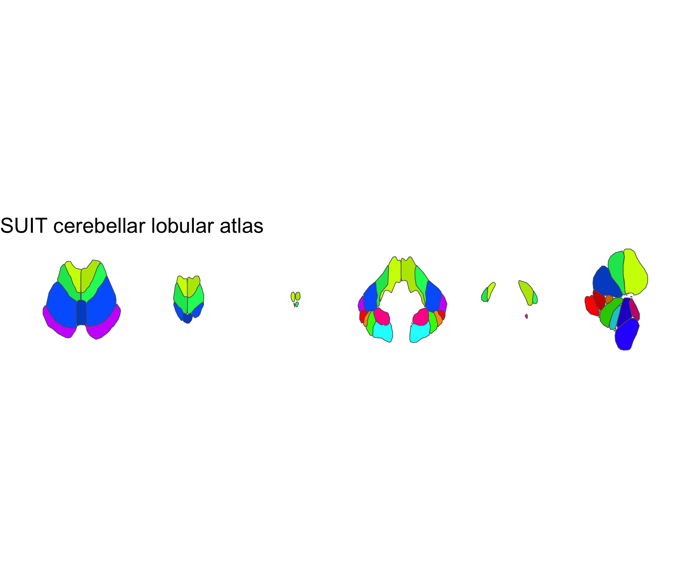

# ggsegSUIT

> **Work in Progress** — This package is under active development and
> has not yet been officially released.

SUIT cerebellar lobular atlas for the ggseg ecosystem.

## Installation

You can install this package from [GitHub](https://github.com/) with:

``` r
# install.packages("pak")
pak::pak("ggseg/ggsegSUIT")
```

## SUIT atlas

``` r
library(ggseg)
#> Loading required package: ggseg.formats
library(ggsegSUIT)
library(ggplot2)

ggplot() +
  geom_brain(
    atlas = suit,
    mapping = aes(fill = label),
    position = position_brain(. ~ view),
    show.legend = FALSE
  ) +
  scale_fill_manual(values = suit$palette, na.value = "grey") +
  theme_void() +
  ggtitle("SUIT cerebellar lobular atlas")
```



## Reference

Diedrichsen J et al. (2009). A probabilistic MR atlas of the human
cerebellum. *NeuroImage*, 46(1), 39-46.

## Code of Conduct

Please note that the ggsegSUIT project is released with a [Contributor
Code of Conduct](https://ggseg.github.io/ggsegSUIT/CODE_OF_CONDUCT.md).
By contributing to this project, you agree to abide by its terms.
